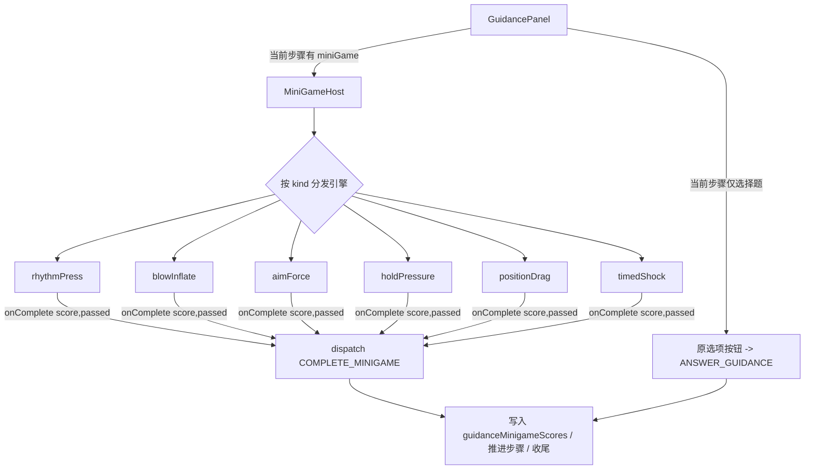

## 产品概述

为急救调度模拟游戏「120调度台」的急救指导环节增加「互动小游戏」实操玩法。当前派车后的指导阶段为纯选择题，本次把其中关键步骤升级为玩家真实动手操作的模拟环节，让心肺复苏按压、海姆立克冲击、止血按压、卒中摆位、AED 除颤等操作可被玩家亲手完成并实时评分。

## 核心功能

- 可复用的小游戏引擎库，按操作类型抽象为 6 种：节奏按压、吹气充胀、瞄准施力、持续按压、摆位拖拽、时机识别除颤
- 指导阶段支持「选择题步骤 + 小游戏步骤」混合编排，小游戏叠加在选择题之后，不影响原有选择题流程
- 小游戏以键盘（空格/方向）为主、鼠标拖拽为辅，使用 Pointer Events 同时兼容触屏
- 小游戏完成后回传操作评分（0-1）与是否通过，计入本通电话的急救指导得分
- 试点覆盖 5 个协议：心脏骤停（按压+吹气+除颤）、异物梗阻海姆立克（瞄准施力）、出血不止（持续按压）、卒中（摆位拖拽）；框架跑通后可在其余 28 个协议卡片中复用同款引擎

## 技术栈

- 前端框架：React + TypeScript（与现有项目一致，无新依赖）
- 渲染方式：原生 DOM + 内联样式 + SVG/Canvas；小游戏交互用 Pointer Events，计时用 requestAnimationFrame，不引入游戏引擎
- 状态管理：沿用现有 useReducer + worldReducer，新增一个 reducer action 接入小游戏结果

## 实现思路

将小游戏定义为「指导步骤的一种可选类型」。每个 `GuidanceStep` 可携带一个可选的 `miniGame` 字段；`GuidancePanel` 渲染时按字段分支：有 `miniGame` 就渲染交互组件，否则走原选择题按钮。小游戏组件为受控组件，结束时通过回调把 `score(0-1)` 与 `passed(bool)` 交给 reducer 记录并推进步骤，完全复用现有 `guidanceStepIndex` 推进与 `closing` 收尾链路，保证无小游戏的步骤行为不变。

### 关键决策

- **数据模型用判别联合（discriminated union）**：`MiniGameSpec` 按 `kind` 细分参数（目标 BPM、拖拽目标坐标、持续秒数、可电击窗口等），保证每个引擎的参数在类型层面安全，避免散落的可选字段。
- **评分与选择题解耦**：新增 `guidanceMinigameScores: (number|null)[]` 与 `guidanceResults` 平行，不污染原有 `'correct'|'incorrect'` 计数；结算时两部分加权合并，原有选择题计分逻辑零改动。
- **新 action `COMPLETE_MINIGAME`**：与 `ANSWER_GUIDANCE` 对称，接收 `{ stepIndex, score, passed }`，写入分数数组、追加来电者反馈对话、推进步骤，最后一步进入 `closing`。
- **复用现有美学与组件骨架**：小游戏宿主 `MiniGameHost` 放在 `src/components/minigames/`，视觉沿用现有深色应急调度台配色与等宽字体，避免引入新设计语言。

### 性能与可靠性

- 每个引擎用单一 rAF 循环驱动动画与计时，组件卸载时清理定时器/监听，避免内存泄漏与后台空转。
- 拖拽/按压用 Pointer Events 并在 `onPointerDown` 调 `setPointerCapture`，避免触屏/鼠标移出元素丢失事件。
- 评分在本地计算后一次性回传 reducer，不在每帧 dispatch，避免高频 re-render。
- 小游戏失败时提供兜底文案（复用 step 的 `feedback.incorrect`/来电者描述），保证流程可继续。

## 实现要点

- `types.ts`：`MiniGameKind` 联合类型；`MiniGameSpec` 判别联合；`GuidanceStep` 增加 `miniGame?: MiniGameSpec`；`WorldState` 增加 `guidanceMinigameScores`。
- `worldReducer.ts`：`START_CALL`/`DISPATCH` 初始化 `guidanceMinigameScores`；新增 `COMPLETE_MINIGAME`；结算处合并小游戏平均分。
- `GameScreen.tsx`：`GuidancePanel` 内对 `step.miniGame` 渲染 `<MiniGameHost>`，`onComplete` 派发 `COMPLETE_MINIGAME`；其余选择题逻辑不变。
- 试点卡片：在 `cardiacArrestCard`、`chokingCard`、`hemorrhageCard`、`strokeCard` 的 `guidance.steps` 末尾追加对应小游戏步骤。
- 沿用项目现有内联样式风格，不新增 CSS 框架。

## 架构设计



## 目录结构

```
src/
├── game/
│   ├── types.ts                      # [MODIFY] 增加 MiniGameKind、MiniGameSpec 判别联合、GuidanceStep.miniGame、WorldState.guidanceMinigameScores
│   └── core/
│       └── worldReducer.ts           # [MODIFY] 初始化 guidanceMinigameScores；新增 COMPLETE_MINIGAME；结算合并小游戏评分
├── screens/
│   └── GameScreen.tsx                # [MODIFY] GuidancePanel 接入 MiniGameHost，选择题分支保持不变
├── components/
│   └── minigames/
│       ├── MiniGameHost.tsx          # [NEW] 按 kind 分发到对应引擎，统一 onComplete 回调
│       └── engines/
│           ├── RhythmPress.tsx       # [NEW] 节奏按压：目标 BPM，空格/点击，检测频率与稳定度
│           ├── BlowInflate.tsx       # [NEW] 吹气充胀：长按充胀，过量惩罚、不足无效
│           ├── AimForce.tsx          # [NEW] 瞄准施力：拖拽标记到解剖位，再冲击，位置+时机计分
│           ├── HoldPressure.tsx      # [NEW] 持续按压：长按保持压力 N 秒，松手血量回升
│           ├── PositionDrag.tsx      # [NEW] 摆位拖拽：拖拽/旋转身体到目标角度
│           └── TimedShock.tsx        # [NEW] 时机识别：可电击窗口内点除颤，误点/错过扣分
└── game/events/cards/
    ├── cardiacArrestCard.ts          # [MODIFY] 追加 rhythmPress + blowInflate + timedShock 步骤
    ├── chokingCard.ts                # [MODIFY] 追加 aimForce 步骤
    ├── hemorrhageCard.ts             # [MODIFY] 追加 holdPressure 步骤
    └── strokeCard.ts                 # [MODIFY] 追加 positionDrag 步骤
```

## 关键代码结构

```ts
// 小游戏类型（判别联合）
export type MiniGameKind =
  | 'rhythmPress' | 'blowInflate' | 'aimForce'
  | 'holdPressure' | 'positionDrag' | 'timedShock'

export interface BaseMiniGame {
  kind: MiniGameKind
  title: string
  instruction: string
  passThreshold: number                // 0-1，达到即通过
  feedback: { good: string; bad: string }
}
export interface RhythmPressSpec extends BaseMiniGame {
  kind: 'rhythmPress'; targetBpm: number; bpmTolerance: number
  durationSec: number; depthSeconds?: number
}
export interface AimForceSpec extends BaseMiniGame {
  kind: 'aimForce'; targetX: number; targetY: number
  aimTolerance: number; thrusts: number
}
// BlowInflateSpec / HoldPressureSpec / PositionDragSpec / TimedShockSpec 类似定义
export type MiniGameSpec =
  RhythmPressSpec | BlowInflateSpec | AimForceSpec
  | HoldPressureSpec | PositionDragSpec | TimedShockSpec

// GuidanceStep 扩展
export interface GuidanceStep {
  id: string
  instruction: string
  prompt: string
  options: string[]
  correctIndex: number
  feedback: { correct: string; incorrect: string; callerCorrect: string; callerIncorrect: string }
  miniGame?: MiniGameSpec               // 新增：小游戏步骤
}

// 引擎组件统一契约
interface MiniGameProps {
  spec: MiniGameSpec
  onComplete: (score: number, passed: boolean) => void
}
```

## 设计风格

小游戏作为「急救指导实操环节」内嵌于现有深色应急调度台界面，沿用游戏既有的深海军蓝底（#0f172a / #020617）、应急红（#ef4444）与青色（#38bdf8）高对比配色，等宽字体呈现读数，整体为「应急指挥控制台 + 动态可视化」风格，不使用浅色或卡通化设计。

## 各引擎视觉描述

- 节奏按压：屏幕中央一个胸腔目标，外圈为随目标 BPM 跳动的同心环脉冲，顶部等宽字体实时显示当前 BPM 与达标进度条；每次有效按压触发一次高亮闪光与下沉反馈。
- 吹气充胀：左侧肺部/气囊充胀量表，按住空格时平滑上升，过量变红并提示胃胀气，不足停留在低位；右侧显示已吹气次数。
- 瞄准施力：SVG 人体侧影，脐上区域为高亮目标圈；玩家拖拽一个施力标记落入目标圈后，按节奏冲击，冲击强度以环形进度呈现。
- 持续按压：伤口处一个压力环，按住时环保持充盈（绿色），松手则血量条快速回升（红色警示），需维持到目标秒数。
- 摆位拖拽：可拖拽/旋转的人体模型，背景有目标角度参考线，角度偏差实时显示，对齐后锁定发光。
- 时机识别除颤：底部 ECG 波形滚动，进入「可电击」窗口时 SHOCK 按钮点亮脉冲，窗口外点击为误击扣分。

## 交互与动效

全部操作使用 Pointer Events 兼容鼠标与触屏；关键反馈采用脉冲（pulse）、平滑过渡（transition）与下沉/闪光微动效；读数使用等宽字体并带轻微发光，营造指挥台临场感。失败与成功均有颜色与来电者对话文字反馈，保持与现有流程一致。